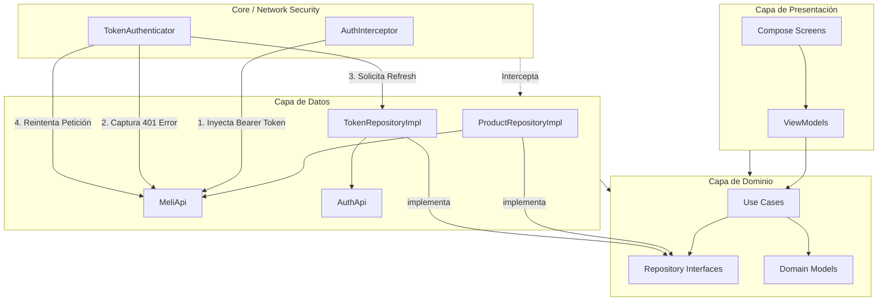

# 🏗️ TECMELI - Mercado Libre Client


**TECMELI** es un cliente de Android robusto para Mercado Libre, diseñado bajo estándares de **Ingeniería Senior**. Implementa una arquitectura modular, segura y altamente escalable.

---

## 🚀 Características Principales

*   🔍 **Búsqueda Avanzada**: Localización de productos en tiempo real con estados reactivos.
*   📦 **Detalle de Producto**: Galería de imágenes, especificaciones técnicas y descripciones.
*   🔐 **Seguridad OAuth 2.0**: Gestión automática de sesiones con refresco de tokens en segundo plano.
*   🎨 **Modern UI**: Interfaz fluida construida enteramente con **Jetpack Compose** y Material 3.
*   🛡️ **Robustez**: Ejecutor de llamadas de red seguro (`SafeApiCall`) con mapeo de errores semántico.

---

## 🛠️ Stack Tecnológico

| Área | Tecnologías |
| :--- | :--- |
| **Lenguaje** | Kotlin + Coroutines + Flow |
| **UI** | Jetpack Compose + Material 3 |
| **DI** | Dagger Hilt |
| **Red** | Retrofit + OkHttp + Gson |
| **Arquitectura** | Clean Architecture + MVVM + UDF |
| **Testing** | MockK + MockWebServer + JUnit |

---

## 📐 Arquitectura Detallada

El proyecto utiliza una estructura de **Clean Architecture** optimizada para el flujo de autenticación de Mercado Libre.

### 📊 Diagrama de Componentes y Flujo Auth (mermaid)



### 🔐 Flujo de Seguridad (OAuth 2.0 Refresh)
1.  **Interceptor**: Cada petición a `MeliApi` adjunta automáticamente el token actual.
2.  **Challenge**: Si el servidor devuelve un `401 Unauthorized`, el `TokenAuthenticator` entra en acción.
3.  **Refresh**: De forma síncrona y transparente, se solicita un nuevo token a `AuthApi`.
4.  **Retry**: La petición original que falló se reintenta con el nuevo token sin que el usuario note interrupción.

---

## 📂 Estructura del Proyecto

```text
com.alcalist.tecmeli/
├── core/               # Infraestructura (Red, DI, Utilidades)
│   ├── di/             # Módulos de Hilt
│   └── network/        # Ejecutores, Interceptores y Logger
├── data/               # Implementación de Datos
│   ├── mapper/         # Transformación DTO -> Domain
│   ├── remote/         # Retrofit APIs y DTOs
│   └── repository/     # Implementación de Repositorios
├── domain/             # Lógica de Negocio Pura
│   ├── model/          # Entidades de Dominio
│   ├── repository/     # Contratos (Interfaces)
│   └── usecase/        # Casos de Uso
└── ui/                 # Capa de Presentación
    ├── screen/         # Pantallas (Compose)
    └── theme/          # Estilo y Diseño
```

---

## 🧪 Estrategia de Testing

Se implementaron pruebas unitarias y de integración para garantizar la fiabilidad:
*   **Mocks**: Uso de `MockK` para simular dependencias y `Log` de Android.
*   **Integration**: `MockWebServer` para probar el flujo real de red y refresco de tokens.
*   **Coroutines**: Uso de `runTest` para garantizar la ejecución determinista de flujos asíncronos.

---

## ⚙️ Instalación y Configuración

1.  Clona el repositorio.
2.  Asegúrate de tener las credenciales de Mercado Libre en tu `local.properties`:
    *   `CLIENT_ID`
    *   `CLIENT_SECRET`
    *   `REFRESH_TOKEN`
3.  Sincroniza con Gradle y ejecuta la aplicación en un emulador o dispositivo real.
---

## 📝 Prompts Utilizados
### Creación de arquirectura

Actúa como un Senior Android Engineer con experiencia en apps productivas.

Quiero generar la base arquitectónica de una app Android en Kotlin usando Jetpack Compose (sin implementar UI todavía).

Objetivo:
Crear una estructura limpia, NO quiero sobreingeniería ni multi-module.

Arquitectura requerida:

- MVVM
- Clean-ish architecture
- Repository pattern
- Hilt para inyección de dependencias
- Retrofit para networking
- OkHttp interceptor para autenticación
- Kotlin Coroutines
- StateFlow para manejo de estado
- DTO → Domain mapping obligatorio

Restricciones importantes:

- No usar múltiples módulos
- No agregar capas innecesarias
- No usar librerías adicionales fuera de las mencionadas
- Código listo para escalar

Requisitos técnicos específicos:

1) Crear sealed class UiState<out T> con:
    - Loading
    - Success
    - Error (con mensaje)
    - Empty

2) Crear un ejemplo sencillo de:
    - ApiService
    - ProductRepository
    - ProductRepositoryImpl
    - ProductViewModel
    - Hilt Module
    - AuthInterceptor

3) El ViewModel debe:
    - Exponer StateFlow<UiState<List<Product>>>
    - Manejar loading, error y success correctamente
    - Usar viewModelScope

4) El Repository debe:
    - Mapear DTO → Domain
    - Manejar errores de red
    - No exponer Response directamente

5) El interceptor debe:
    - Agregar header Authorization Bearer token
    - Obtener el token desde un TokenProvider simple

Entrega:

- Mostrar estructura de carpetas
- Mostrar interfaces y clases principales
- Mostrar ejemplo funcional mínimo
- No generar UI Compose todavía
- Enfocarse solo en arquitectura y networking

### Revisión de código

Actúa como un Senior Android Engineer con experiencia en revisión de código en equipos productivos.

Quiero que hagas una revisión técnica profunda enfocándote en:

1) Principios SOLID:
    - Single Responsibility
    - Open/Closed
    - Liskov Substitution
    - Interface Segregation
    - Dependency Inversion

2) Arquitectura:
    - Separación correcta de capas (data, domain, ui)
    - Correcto uso de Repository pattern
    - DTO → Domain mapping adecuado
    - ViewModel libre de lógica de data
    - Evitar filtraciones de capas (por ejemplo exponer DTOs en UI)

3) Calidad del código:
    - Duplicación de código (DRY)
    - Código innecesario o sobreingeniería
    - Clases demasiado grandes
    - Responsabilidades mezcladas
    - Nombres poco claros
    - Posibles refactors

4) Manejo de errores:
    - Uso correcto de Result o UiState
    - Manejo adecuado de excepciones
    - No exponer Response directamente
    - No usar try/catch innecesarios

5) Buenas prácticas Android:
    - Uso correcto de StateFlow
    - No bloquear el hilo principal
    - Inyección adecuada con Hilt
    - Interceptor bien implementado

Formato de respuesta:

- Problemas encontrados (explicados claramente)
- Riesgos técnicos
- Qué está bien implementado
- Recomendaciones concretas con ejemplo de mejora
- Nivel general del código (Junior / Mid / Senior ready)

No quiero explicaciones teóricas largas.

### Documentación

Actúa como un Senior Android Engineer responsable de mantener una base de código en producción.

Tu tarea es EXCLUSIVAMENTE mejorar la documentación del código.

Reglas estrictas:

- NO cambies la lógica.
- NO refactorices.
- NO renombres variables.
- NO optimices.
- NO modifiques estructura.
- SOLO agrega o mejora documentación.

Sobre la documentación:

1) Usa KDoc profesional (/** */) para:
    - Clases
    - Interfaces
    - Métodos públicos
    - ViewModels
    - Repositories
    - Interceptors

2) La documentación debe explicar:
    - Responsabilidad de la clase
    - Qué problema resuelve
    - Cómo se integra en la arquitectura
    - Contratos importantes
    - Casos especiales si existen

3) Evita documentar cosas obvias.
4) Evita comentarios redundantes como "// set value".
5) No expliques sintaxis, explica intención y diseño.

Formato de respuesta:
- Devuelve el código completo con la documentación corregida.
- No agregues explicación adicional fuera del código.

Desarrollado con ❤️ para **TECMELI**.

